## COP290 Task2: Maze Game
This is the readme for COP290(Design Practices) Task2: Maze Game.<br>
Contributed by: Arushi Goyal(2020CS50418) and Supreeti Kumari(2020CS10396)<br>

## IITD Maze Treasure Hunt

### Instructions:
- This is a 2-player game with the objective to find treasures using the hints provided. These treasures will earn you points. 
- The player also needs to refrain from entering restricted areas which are indicated through warnings during the course of the game. You receive some penalty upon stumbling over these areas.
- Treasures can also be looked for inside certain buildings.

### Game Controls:
- Use arrow keys to navigate inside the campus.
- Use number keys(1 to 8) to display and hide hints(Press ‘1’ to display first hint and press it again to hide the hint).
- Press ‘E’ to enter a building and press it again to  exit. You can also use the exit button on the building maps to go back to the main map.
- Use letter keys(‘a’ to ‘c’) to display warnings(Press ‘a’ to display first warning and press it again to hide the warning).
- Use the quit button on the main map to quit the game.

### Treasures:
- Ruby worth 150 points
- Sapphire worth 200 points
- Pearl worth 25 points
- Silver worth 75 points
- Gold worth 175 points
- Emerald worth 100 points
- Coins worth 50 points
- Diamond

**General Note**: Each player has 3 lives. You lose one life and earn some penalty upon stumbling over some restricted area. Also, this is a timed game; you have ``` 5 minutes ``` to play this game.<br>

### Winning criteria:

- The player who finds the diamond first wins the game.
- In case no player is able to find the diamond within the designated time, the one with the maximum score at the end of the timer, wins.
- In case a player exhausts all his lives, the other player automatically wins the game. 

---

### Different maps used in our game:

- Main map for IITD campus:<br><br>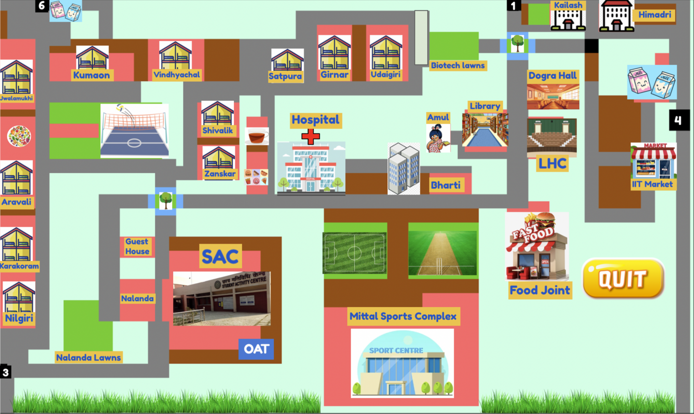
- Dogra Hall: <br><br> 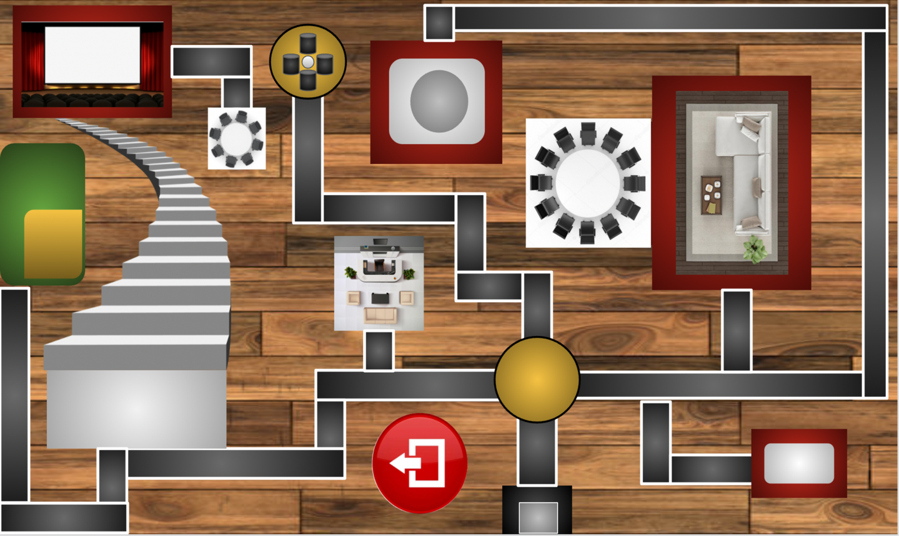
- Karakoram:<br><br>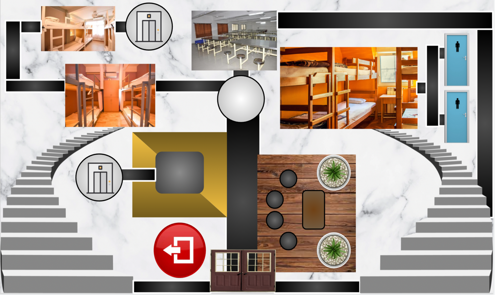
- Jwalamukhi:<br><br>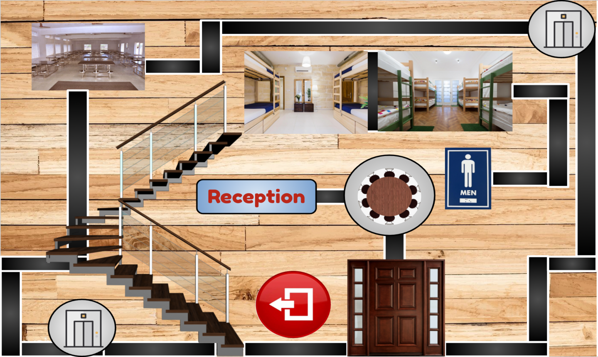

### Different screens:

- Start screen: <br><br>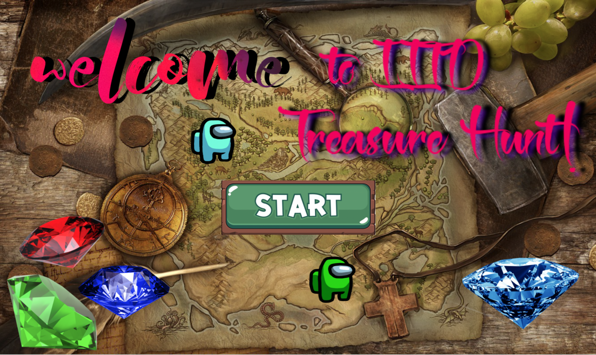
- Instruction screen: <br><br>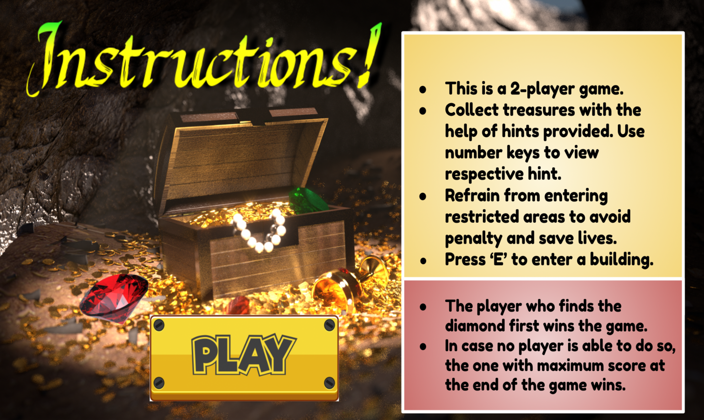
- Winning screen1: <br><br>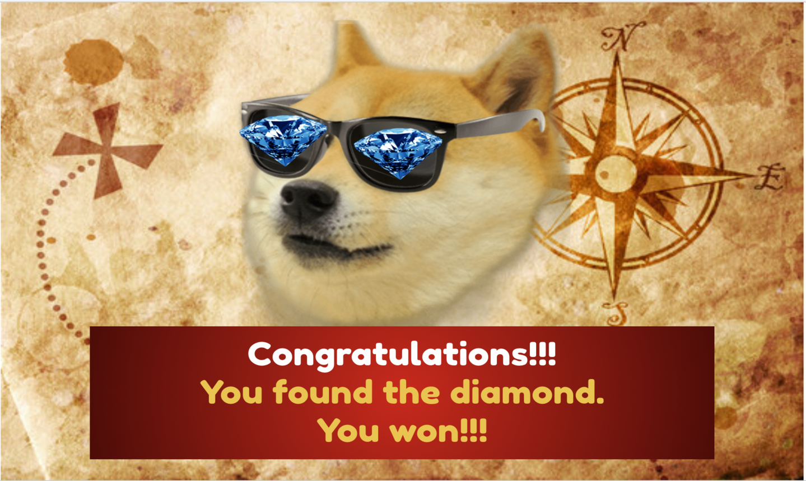
- Winning screen2: <br><br>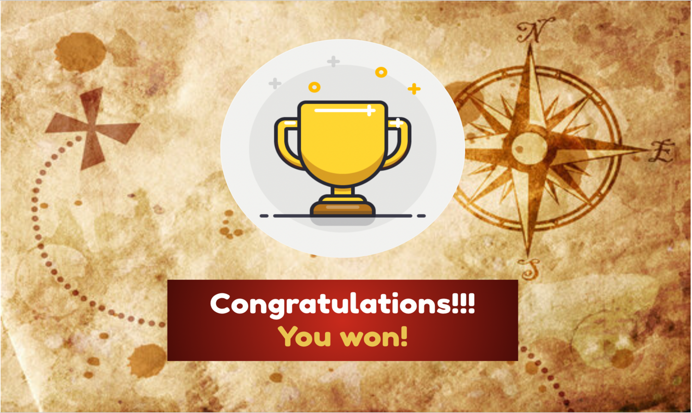
- Losing screen: <br><br>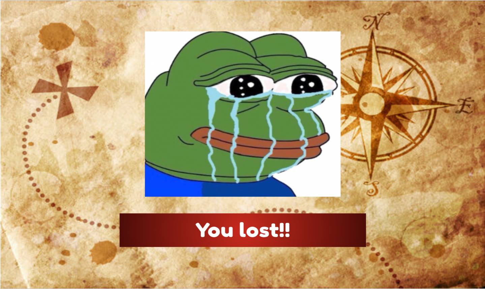
- Game over screen: <br><br>

### Players:

- Player1: <br><br>      
- Player2: <br><br>

### Hint Example:
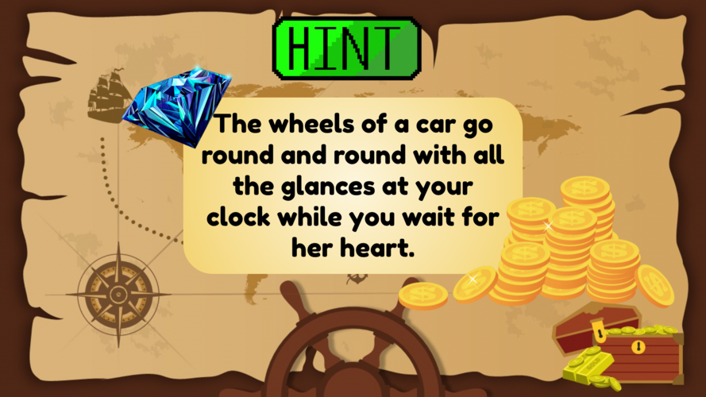<br>

### Warning Example:
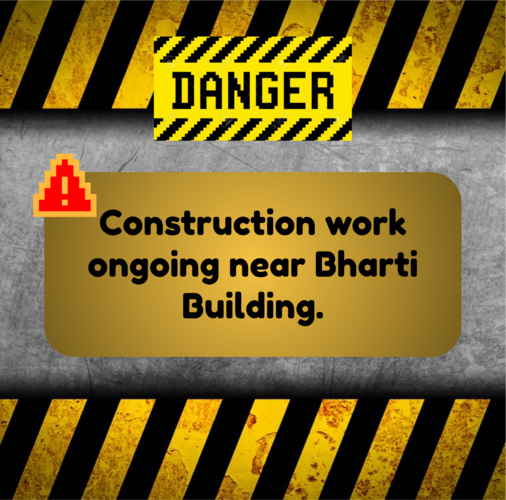<br>

### Treasure Example:
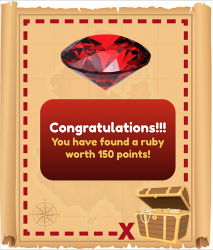<br>

### Penalty Example:
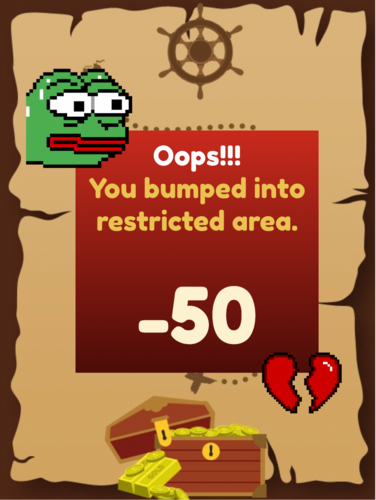    

## How to run the game:

1. Navigate to the location on your system where you want to clone the repository.
2. Clone our git repo using the command: ``` git clone ```  https://github.com/SupreetiKumari/COP290-MazeGame
3. Enter username and PAT as the password.
4. Run ``` cd COP290_MazeGame ```.
5. Depending upon whether you are the server or the client, navigate to the respective folder using ``` cd client/server ```.
6. Run ``` make ```.
7. The game window is visible.

---
Our folder COP290-MazeGame consists of the following contents:

- client folder
- server folder
- IITD Maze Treasure Hunt.pdf: Slides explaining the crux of our game
- Readme.md

A brief description of the files contained within client/server folders:

- hints folder: Consists of 30 hints to the locations where treasures are hidden. 
- warning folder: Consists of 9 warnings about restricted areas.
- treasure: Consists of 8 treasures. These pop-up when you successfully find the hidden treasure using the hints provided. They add to your score depending upon the treasure you found.
- penalty: Consists of 9 penalties which pop-up when you enter restricted areas. They decrease your score depending upon the area you stumbled upon.
<br>

1. LTexture.cpp- This file contains the class-LTexture and its constructor, deconstructor and functions.
2. Dot.cpp- This file contains the class-Dot ( this the class for the player ) and its constructor, deconstructor and functions.
3. helper.cpp- This contains the helper functions that we have used in our main program for example setwalls etc.
4. sdl_helper.cpp- This contains some other helper functions which mainly use SDL.
5. LTimer.cpp - This contains the Timer class for handling time-related jobs.
6. music.hpp - This is the file with the help of which we carry out music related job.
7. server.hpp- This the file which is present in server folder and is used by the person who is the server. It contains sendreceive function which is the main function for sending and receiving data.
8. client.hpp- This the file which is present in client folder and is used by the person who is the client. It contains sendreceive function which is the main function for sending and receiving data.
9. cop.cpp - This is the main file which contains the entire implementation and code.
10. Makefile- This is the make file and is separate for the two folders- server and client.


## CODE IMPLEMENTATION-

1. Our code consists of three settings and we have used randomization for calculating which setting the user gets, using the rand function.We have maintained 2 arrays for checking if we already got some treasure / penalty both of which are completely distinct. We have used the render function to display the popups of penalty, warning and treasure and used SDl_delay for keeping it for some time. With the help of keyevents function we are able to enter inside a building and move out of a building. 
2. In each of the respective setting we have functions caleed set1point1s( for example) which enables us to hide diamond for example in karakoram. The statement - clientdata = player1.sendrecieve(data) helps in movind the required data between the server and the client. The getopponentdata function helps in breaking down that data into chunks. We have maitined the points of a player with the help of an attribute called cpoints, which is defined in the Dot class.  Now we have set the points corresponding to diamond equal to 6000, therefore as soon as a player gets 6000 points , that player losses. We have calculated the time with the help of SDL_GetTicks function. If the time left ( total time being equal to 300 seconds) gets less than 5 seconds , we pass the score of the player to and fro and declare the winner according to the score. There is also and attribute called lives in the dot class. Witht the help of this attribute we are able to assign lives to the players. Hence as soon as any player exhausts all its lives, it loooses and the other player wins, irrespective of who has more score.
